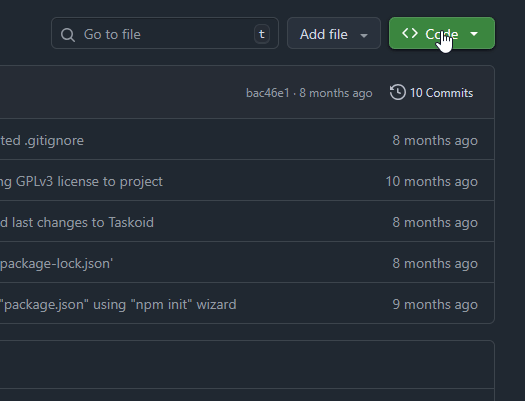
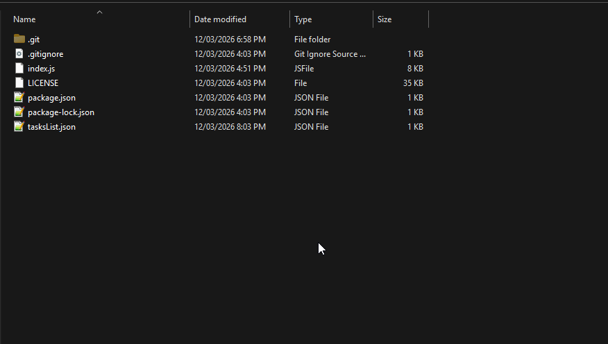
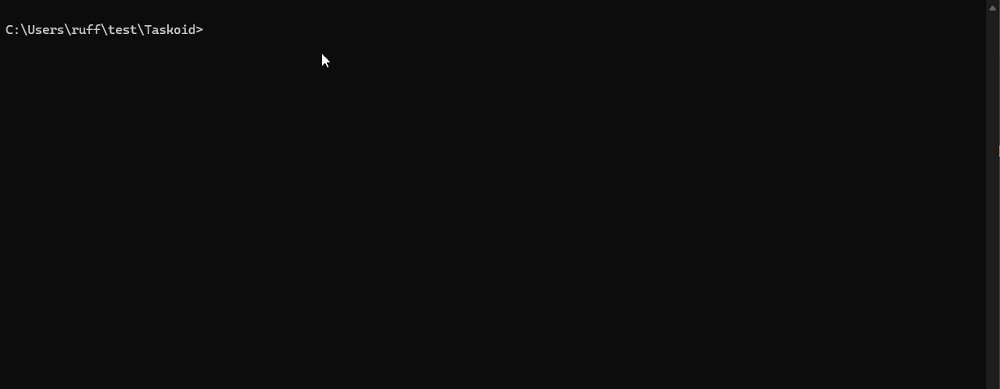

# Taskoid

<h2 id="descricao">Descrição</h2>

Projeto baseado no ["Task Tracker"](https://roadmap.sh/projects/task-tracker), ideia de projeto do Roadmap.sh relacionado a área de desenvolvimento *back-end*, onde a tarefa foi construir um aplicativo de linha de comando (CLI) para gerenciar tarefas em um sistema de *"todo list"*.

O projeto tem algumas restrições e requisitos, como o uso de um arquivo JSON para armazenamento das tarefas, uso das funções padrão da linguagem para o projeto (sem bibliotecas ou frameworks), uso de argumentos posicionais na linha de comando para aceitar entradas de usuário, entre outros detalhes.

<h2 id="instalacao-e-modo-de-uso">Instalação e Modo de uso</h2>

1. Para realizar a instalação, você pode usar as ferramentas Git, ou baixar como zip pelo GitHub:
    1. 'git clone':
	```
	git clone https://github.com/gabriruf/Taskoid.git
	```

    2. ou baixar como zip:
 

2.  Após a instalação, dentro da pasta raiz do projeto, abra um emulador de terminal dentro da pasta (ex: PowerShell, cmd, Windows Terminal, etc)


4. Pronto!!! - Agora é só utilizar o programa:


<h2 id="sintaxe-e-comandos">Sintaxe e Comandos</h2>

**para a função add:**
- node index.js \[ função \] \[ nome da tarefa \]

**para as funções update, mark e delete:**
- node index.js \[ função \] \[ id da tarefa \]

---
- ***add***: adiciona uma tarefa;
- ***update***: atualiza a descrição de uma tarefa;
- ***mark***: marca uma tarefa como "*done*" (pronto), "*todo*" (para fazer) ou "*inProgress*" (em progresso);
- ***del || delete***: exclui uma tarefa;
- ***ls || list***: lista todas as tarefas com ou sem filtro;
- ***help***: mostra todos os comandos do Taskoid e suas funções.

